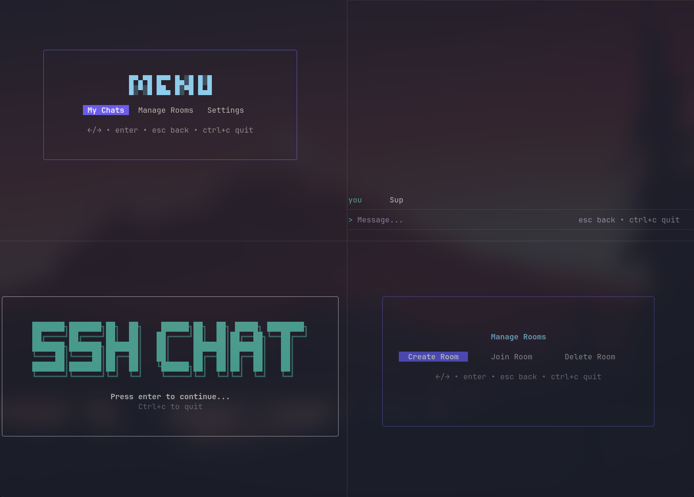

# 💬 SSH Chat

SSH Chat is a terminal chat app served over SSH.

Built with Go, Wish, Bubble Tea, and SQLite.



## 🚀 Try live

```sh
ssh ssh.luja.dev -p 2222
```

## ✨ Features

- SSH server entrypoint: connect with an SSH client, no web browser needed.
- Username/password signup and login with bcrypt password hashing.
- Optional SSH key linking for passwordless app login on later connections.
- Persistent rooms, room memberships, invite codes, and message history.
- Live room broadcasts for messages, joins, leaves, and room deletion.
- Terminal UI screens for welcome, auth, main menu, room list, room management, settings, and chat.
- Docker image and Compose setup for running with a persistent data volume.

## 🛠️ Running locally

```sh
SSH_CHAT_HOST=127.0.0.1 \
SSH_CHAT_PORT=2222 \
SSH_CHAT_HOST_KEY_PATH=.ssh/ssh_host_ed25519 \
SSH_CHAT_SQLITE_PATH=data/ssh-chat.sqlite \
go run ./cmd/ssh-chat
```

Then connect from another terminal:

```sh
ssh -p 2222 localhost
```

## 🏗️ Architecture overview

The app is split into small internal packages with clear roles:

- `cmd/ssh-chat` starts the SSH server, loads environment config, opens SQLite, creates services, and creates one Bubble Tea session per SSH connection.
- `internal/session` is the application coordinator. It owns authenticated user state, navigation between screens, the active room subscription, and resource cleanup when a user leaves or quits.
- `internal/tui` contains the Bubble Tea models. These views render terminal screens and emit intent messages such as `RoomSelected`, `SendRequested`, or `CreateRoomRequested`; they do not call storage or services directly.
- `internal/chat` contains room and message behavior. It combines a persistent store interface with in-memory live room subscriptions used for active broadcasts.
- `internal/auth` contains signup, login, linked SSH key, and account deletion behavior.
- `internal/storage/sqlite` implements the auth and chat store interfaces with SQLite migrations and queries.

## 🔐 SSH keys and Authentication

After login or signup, the app will automatically offer to link the SSH key used to connect, making future logins passwordless.

Each account can link or delete one SSH key in settings. Linking a new key replaces the old one.

The server accepts any SSH public key at the transport layer so the app can read the key fingerprint. App-level authorization still happens inside the TUI through password login or a previously linked SSH key.
